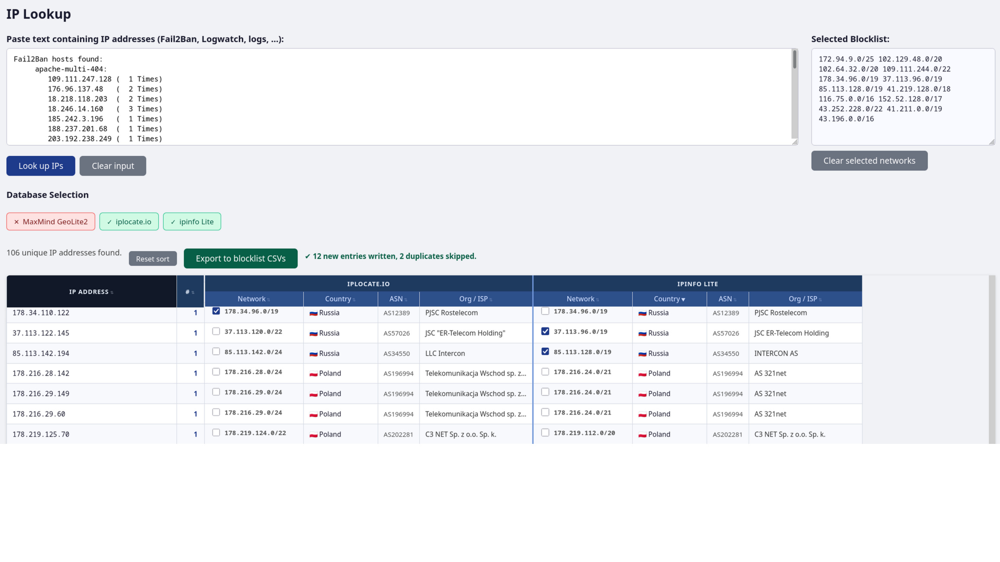

# IPTables Blocklist Manager



This is a PHP web app to manage per country/ASN blocklists.
There is also a search form to test a list of IP addresses against local GeoIP databases
printing country, ASN and network range.
Supports MaxMind GeoLite2, iplocate.io, and ipinfo Lite databases.

## Features

- Manages per country/ASN blocklists for IPv4/6
- Query multiple GeoIP databases per IP
- Select networks to export by country and IP version (IPv4/IPv6)
- Generate presistent blocklists as separate CSV files per country code or ASN
- Deduplication: prevents duplicate entries when exporting or updating
- Locally cached network ranges per ASN list (offline generation using asn_cache_generator.py)
- manual/cron-controlled update of iptables rules after changes to the local blocklists

## Disclaimer

<b>This thing is mostly AI generated</b> by throwing a more or less sophisticated streak
of prompts at github copilot. Considering this, it works well enough for me because
  1. I run this locally and am only feeding it input I trust (my own server's Logwatch reports). 
  2. Would I trust this to run publicly exposed?
     Better not...

<b>Use with care! Better do not expose to public access!</b>

## Requirements

- PHP 8.0+ with `maxminddb` extension
- MMDB database files (MaxMind, iplocate.io, or ipinfo)
- Web server with write access to `blocklist_csvs/` directory

## Setup

1. **Download MMDB database files manually:**
  (not all are necessary, app will ignore missing DBs)
   - iplocate.io: https://iplocate.io/
   - ipinfo Lite: https://ipinfo.io/
   - (Commercial) MaxMind GeoLite2: https://www.maxmind.com/en/products/geoip2/geolite2
2. Place `.mmdb` files in the same directory as `index.php`
3. Adjust file paths/names in `mmdb_config.php` if needed
4. Create the folder "blocklist_csvs/" and make sure is writable by the web server user

## Usage

1. Paste "Fail2Ban hosts found:" section from the Logwatch report in the input field
2. Select a result set by checking one checkbox per row
3. Click "Export to blocklist CSVs"
4. CSV files are saved to `blocklist_csvs/{CC}_v4.csv` and `blocklist_csvs/{CC}_v6.csv`
5. After a change to a blocklist run "sudo update_iptables.sh" to update the iptables rules
   (Adds and removes new and removed entries)

## CSV Format

```
network,added_at,country,asn,org,source
1.2.3.0/24,2026-04-24 12:00:00,China,AS4134,CHINANET-BACKBONE,maxmind
```

- **source**: Database used (maxmind, iplocate, ipinfo)
- Files append; existing CIDRs are skipped to prevent duplicates

